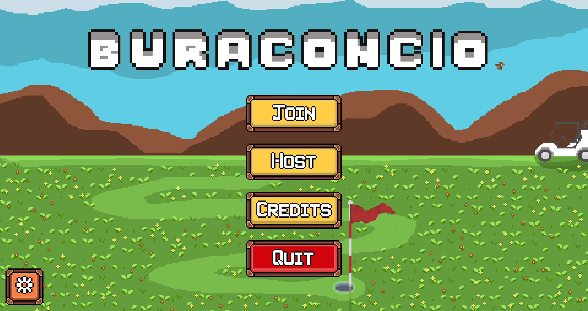
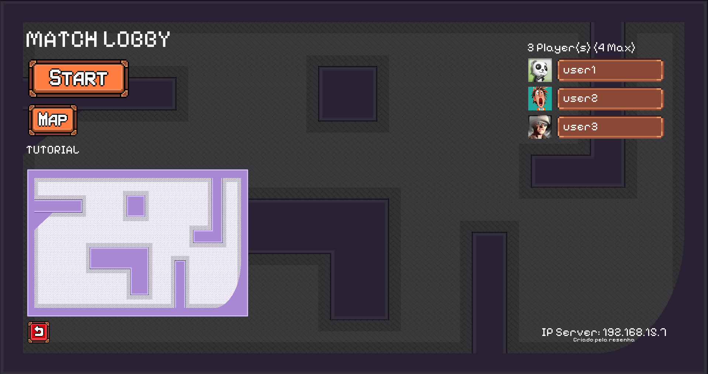
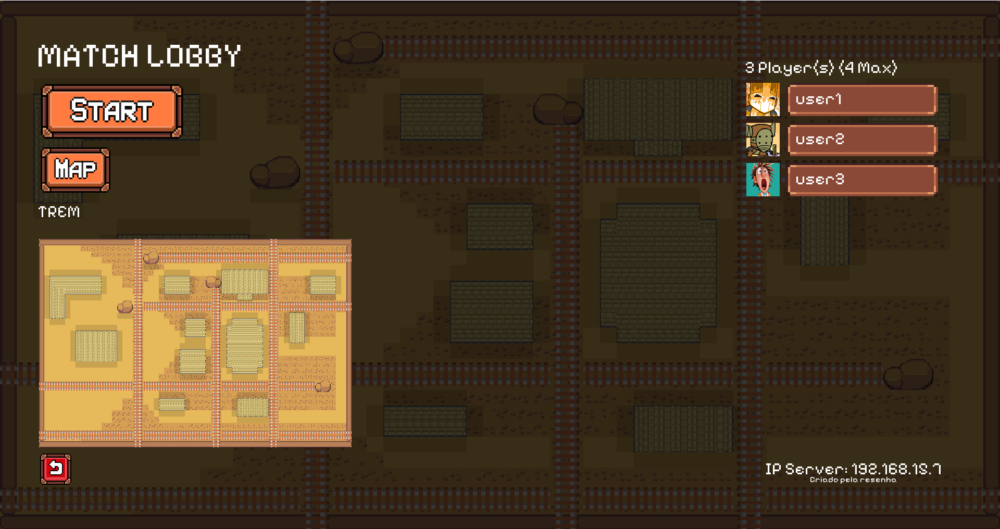
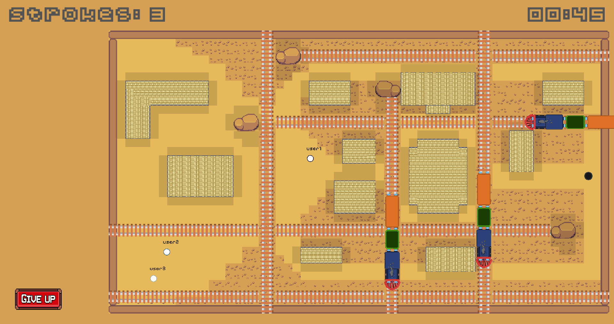
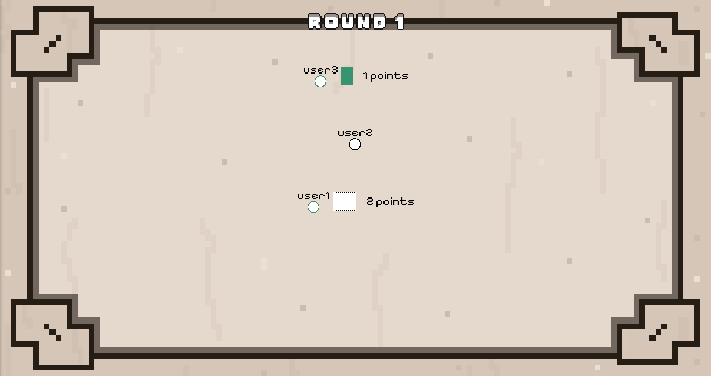
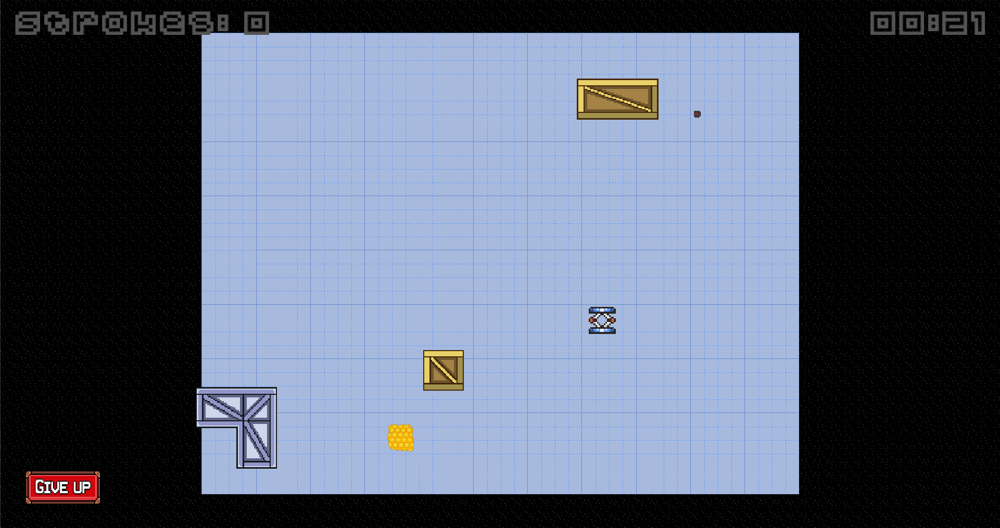

# Buraconcio

## About the Project

**Buraconcio** is a game developed by @ringass, @argArthur, @mukaimasao, and @davifsouza648 as part of an academic assignment for the Object-Oriented Programming subject in the Computer Science course at **UNESP – Bauru**.

The project is built in **Java**, using the **LibGDX** and **Box2D** libraries. It applies various programming concepts learned in class, such as **sockets**, **threads**, and **object-oriented design**.

---

## The Game

Buraconcio is a **top-down golf-like game** where the maps evolve dynamically during gameplay. Inspired by _Ultimate Chicken Horse_, it allows players to freely place (or erase) obstacles between rounds, resulting in a chaotic and unpredictable environment.

---

## How to Run

> Make sure you have Java and Gradle installed.

### Steps to start:

1. **Clone the repository:**

```bash
git clone https://github.com/your-username/Buraconcio.git
cd Buraconcio

```

2. **Run the project using Gradle**

```bash
./gradlew run
```

## Main Menu



## Server Screen

<p align="center">
  
  
</p>

## In Game



## Points Screen



## Select Obstacle



## Victory Screen


## Sounds

The game features a complete sound environment — including button click effects, background music in the lobby and server screens, and proximity-based obstacle sounds.  
Each obstacle has its own unique audio feedback, and every map includes an exclusive soundtrack to enhance the gameplay experience.

## TODO

### Erros

- [ ] Pontuação inconsistente

### Implementações

- [ ] Sistema de envio de pontuação
- [ ] Ventilador

### ASSETS

- [ ] VENTILADOR 😢😢😭😭😭😭😭😭😭😭😭😭😭😭😭😭
